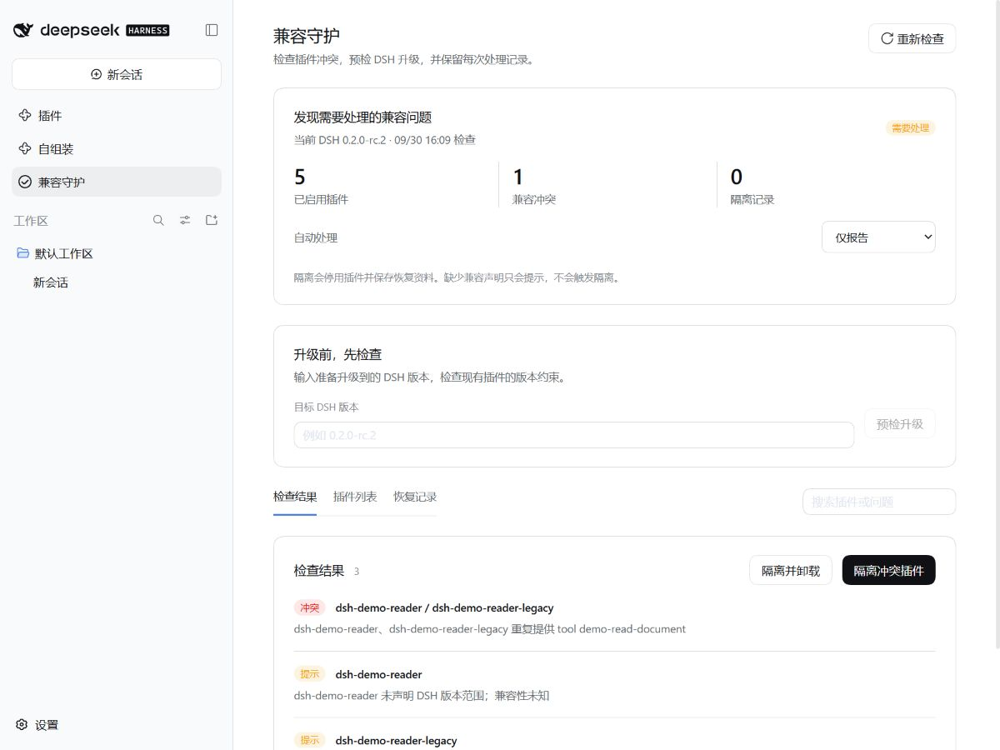

# dsh-compat-guardian

**Compatibility checks, quarantine and recovery for DeepSeek Harness plugins.**

检查 DSH 版本要求、Node.js 与系统要求、声明的插件依赖和互斥关系、重复顶层条目、全局独占工具与服务，以及真实 Loader 的连续加载失败。

当前实测宿主为 DSH `0.2.0-rc.2`。宿主 peer 声明允许 `>=0.2.0-rc.2 <0.3.0-0`，避免每次同系列升级都先被自身的精确版本门禁拦住；该声明不代表后续版本已经验证。独立检查与离线修复命令不加载 DSH 宿主或第三方插件，可以在宿主无法启动时使用。

## 安装

```powershell
dsh plugin --profile web add dsh-compat-guardian@0.2.0 --save-exact --ignore-scripts
```

安装后打开侧边栏“兼容守护”。默认自动隔离，卸载需选择对应策略。独立 CLI 可通过 `npx --yes --package=dsh-compat-guardian@0.2.0 dsh-compat-guardian --help` 查看用法，DSH 无法启动时也可使用。

[源码](https://github.com/Han-1413141/dsh-compat-guardian) · [问题反馈](https://github.com/Han-1413141/dsh-compat-guardian/issues) · [故障覆盖表](https://github.com/Han-1413141/dsh-compat-guardian/blob/master/docs/failure-matrix.md)

## Web 页面

侧边栏“兼容守护”提供检查结果、插件列表、恢复记录和名称筛选。隔离或卸载前弹窗列出受影响的插件；提交时再次核对插件状态，检查后已发生变化则要求刷新。恢复前重新检查，冲突仍存在时保留隔离并显示原因。

升级预检只计算输入版本下的兼容声明，不下载或升级 DSH。预检假设官方 profile 基础组件随 DSH 一起升级；附加插件继续使用已安装版本的约束。没有将未知未来版本当成已运行验证。

页面上的自动策略在确认后立即保存到目标 profile 的 `.compat-guardian/preferences.json`，优先于下面的 YAML 默认值。要恢复由 YAML 决定策略，关闭该 profile 后移走这个偏好文件。检查结果按“重新检查”刷新；后台监控按配置周期执行。

## 自动策略

默认每 30 秒检查一次，加载失败连续观察 2 次才处理；明确的版本或声明冲突直接进入处理。

| policy | 行为 |
| --- | --- |
| `report` | 保存检查状态；不改插件选择，不卸载 |
| `quarantine` | 默认值。备份后停用冲突 bundle，保留包文件 |
| `remove` | 先停用，确认成功后调用官方管理接口卸载可移除包 |

通过 profile 的 `cordis.patch.yml` 设置：

```yaml
- id: compat-guardian
  config:
    policy: quarantine
    intervalMs: 30000
    failureThreshold: 2
```

改为 `policy: remove` 即启用自动卸载。不删除用户工作文件、历史会话或独立配置备份；官方组件和这两个管理插件受到保护。启动型 profile 要求重启才能完成停用时，保留 `restart-required` 结果。在线卸载被宿主拒绝时保留隔离与待卸载记录，在下一次启动后重试；同一进程不会反复卸载失败目标。

Guardian 对 bundle 操作，因为 bundle 可能包含需要一起启停的多个条目。依赖已隔离插件的其他 bundle 会一起进入停用计划。同名服务并行注册时，优先保留实际已正常运行的一方；没有运行状态可供选择时，按 `dshCompat.priority` 与 profile 选择顺序决定。

插件在外部被重新启用时，旧隔离记录转为已恢复；换成其他版本时，旧记录标记为已替换，不再按旧版本执行卸载。连续失败按插件版本和 DSH 版本分别计数。

## DSH 工具

工具 `compat_guardian` 提供：

- `check`：检查当前已安装和运行中的插件。
- `repair`：按配置策略执行处理，通过 DSH 批准服务确认会话发起的修改。
- `history`：查看隔离、卸载和恢复记录；不返回配置备份原文。
- `restore`：提供 `recordId`，重新检查后恢复已隔离、仍安装且版本未改变的插件。

已卸载插件需要先重新安装原版本或修复后的版本。恢复不会通过强制版本豁免绕过冲突。

## 升级前检查与启动修复

在仓库根目录执行，替换路径和目标 DSH 版本：

```powershell
# 只读检查；存在错误时退出码为 2。
node lib/cli.js check --profile-dir "C:/Users/you/.dsh/profiles/web" --dsh-version 0.2.0-rc.2

# 先查看离线修复计划。
node lib/cli.js rescue --profile-dir "C:/Users/you/.dsh/profiles/web" --dsh-version 0.2.0-rc.2

# 关闭目标 DSH 后执行停用，备份原配置。
node lib/cli.js rescue --profile-dir "C:/Users/you/.dsh/profiles/web" --dsh-version 0.2.0-rc.2 --yes

# 明确知道故障包，但它没有声明版本范围时，可以按包名停用。
node lib/cli.js rescue --profile-dir "C:/Users/you/.dsh/profiles/web" --dsh-version 0.2.0-rc.2 --plugins bad-plugin --yes

# 修复冲突或回退 DSH 后恢复，只合并本次停用项。
node lib/cli.js restore --profile-dir "C:/Users/you/.dsh/profiles/web" --dsh-version 0.2.0-rc.2 --id <recoveryId> --yes
```

源码版或 Desktop 的安装位置不同，可通过 `--install-anchor <DSH安装包/package.json>` 指定查找官方 bundle 的位置。目标 DSH 版本由 `--dsh-version` 明确指定；不要用其他安装的版本冒充实际宿主。

离线修复保留原始 `package.json` 文本及校验值，备份 `cordis.patch.yml`、锁文件和兼容配置；实际只删除 `dsh.profile.bundles` 中被隔离的选择，不卸载依赖。修改使用与官方写入器一致的跨进程锁及原子文件替换。恢复时检查版本与冲突，只合并相应 bundle，保留此后其他编辑。

## 插件作者如何声明互斥关系

在插件的 `package.json` 顶层增加 `dshCompat`。这是本项目定义的可选元数据，**不是 DSH 官方标准**。

```json
{
  "dshCompat": {
    "dsh": ">=0.2.0-rc.2 <0.3.0",
    "capabilities": ["pdf"],
    "requires": { "your-parser-plugin": "^1.0.0" },
    "conflicts": { "another-pdf-plugin": "<2.0.0" },
    "services": ["globalPdfParser"],
    "tools": ["read_pdf"],
    "permissions": ["workspace-read"],
    "platforms": ["win32", "linux", "darwin"],
    "priority": 10
  }
}
```

`services` 和 `tools` 只列出会争用同一全局名称的独占提供项，不要把不同 Cordis scope 中可共存的项目填进来。检测顶层 `insert` 的重复 id 时，不会把正常的 id 定向覆盖当作重复声明。`!!js` 配置只作为文本读取，不执行。

没有声明的冲突不能靠静态扫描全部识别。Guardian 观察明确的 `failed` 状态，不把依赖尚未就绪的 `pending` 状态当作崩溃。其代码与其他 Host 插件仍在同一进程；无法拦住 `process.exit()`、原生崩溃或在启动早期退出的宿主。此类情况使用独立 CLI 进行停用与恢复。

## 开发与验证

本仓库可独立构建和测试，无需检出另一个插件：

```powershell
npm ci --ignore-scripts
npm run typecheck
npm test
npm run build
npm run test:conflicts
npm run test:startup
npm run preview
```

配套插件：[dsh-autocompose](https://github.com/Han-1413141/dsh-autocompose)。两者可分别安装。

[故障覆盖表](docs/failure-matrix.md) · [验证记录](docs/validation.md) · [版本记录](CHANGELOG.md)

## 界面


